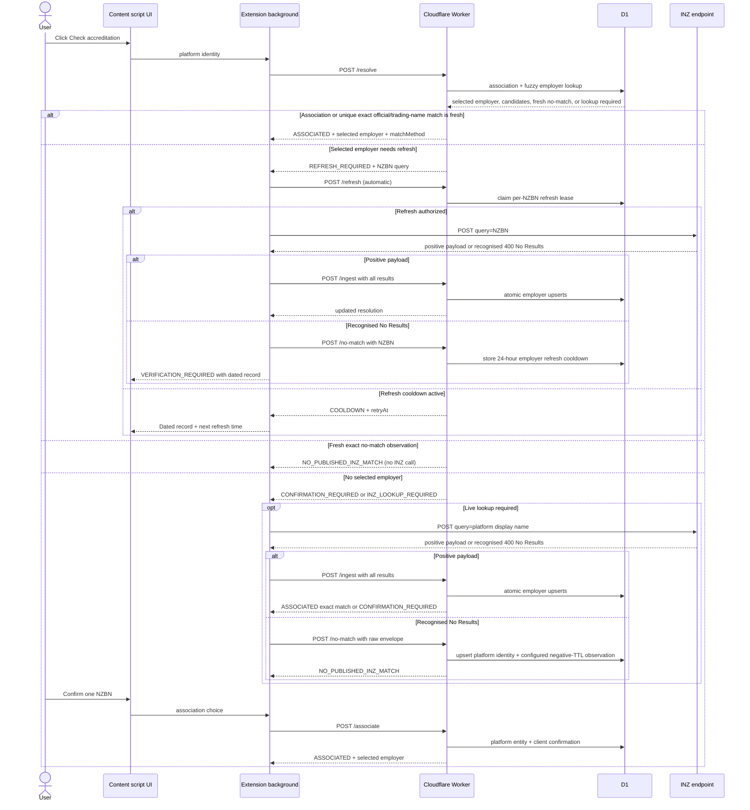

# Extension ↔ Accredited Employer API SSOT

Status: active  
API version: `v1`  
Service version: `0.7.1`
Last updated: 2026-08-16
Production base URL: `https://nzaei.zemo.bio/api`

This document is the single source of truth (SSOT) for the browser extension and Worker contract. Extension code must not infer behaviour by reading the `api/` implementation.

## 1. Product model

The product is a shared accredited-employer data source, not an INZ search-response cache.

- `employers` is the canonical asset. One row represents one NZBN and the latest accepted INZ accreditation observation.
- Immigration New Zealand (INZ) is the SSOT for employer name, trading name, NZBN, accreditation expiry, and verification time.
- LinkedIn/SEEK associations are community confirmations. They are useful identity mappings, but are not official INZ facts.
- A unique exact official-name match is a derived resolution, not a stored association: the normalised platform `displayName` must exactly equal one NZBN's official INZ `employerName` or `tradingName`.
- The Worker does not call INZ. A live INZ lookup only happens in the extension background after an explicit user action.
- The MVP has no general D1 search-cache table. It stores exact, platform-bound INZ no-match observations and per-NZBN refresh cooldown metadata; neither is an accreditation claim.

These independent truth and provenance dimensions must stay visible in code and UI:

| Dimension | Source | Meaning |
| --- | --- | --- |
| Accreditation | INZ | Whether an NZBN is published and its accreditation expiry date. |
| Platform association | Extension users | Which NZBN corresponds to a LinkedIn company or SEEK advertiser/profile. |
| Automatic exact-name match | Worker-derived | Exactly one NZBN's official `employerName` or `tradingName` equals the platform display name after normalisation. It is not community-confirmed and is not persisted. |
| Platform no-match observation | INZ lookup submitted by extension | This exact platform identity and normalised display-name query returned no published INZ result within the configured negative TTL. |
| Employer refresh attempt | Extension + Worker | A user-triggered NZBN lookup was authorized, succeeded, or returned no published result; this controls duplicate calls without changing official verification provenance. |

## 2. Components and responsibilities

- Content script: identifies the current platform entity, injects the widget, renders candidates, and captures an explicit association choice.
- Extension background service worker: owns `X-Client-ID`, calls the Worker, calls INZ after a user click when required, and submits successful INZ results.
- Cloudflare Worker: validates requests, searches/upserts `employers`, aggregates community confirmations, derives exact official/trading-name matches, evaluates freshness/accreditation, coordinates per-NZBN refresh leases/cooldowns, stores short-lived exact no-match observations, and rate-limits clients.
- D1: stores canonical employers, refresh coordination metadata, platform associations/confirmations, and platform-bound no-match observation fields.
- INZ: official lookup called directly by the extension, never by the Worker.

Worker freshness policy is configured with positive integer second values in `POSITIVE_TTL_SECONDS`, `NEGATIVE_TTL_SECONDS`, `REFRESH_ATTEMPT_COOLDOWN_SECONDS`, and `REFRESH_NO_MATCH_COOLDOWN_SECONDS`. The defaults are 30 days, seven days, 15 minutes, and 24 hours respectively. Wrangler environment variables are non-inheritable, so every named environment declares all four values explicitly.



There is no automatic lookup on page load, automatic pagination, list traversal, pre-warming, or bulk search. A single click may perform at most one INZ request. Every displayed employer also has a manual `Refresh from INZ` action; it uses the same per-NZBN lease and cooldown and never creates an association.

## 3. Platform identity

Every resolve/ingest/no-match/refresh/associate request contains the same `PlatformIdentity` for the current page:

```ts
type Platform = "linkedin" | "seek";
type PlatformIdentityKind =
  | "linkedin_company_url"
  | "seek_company_profile"
  | "seek_advertiser_name";
type IdentityStrength = "strong" | "weak";

interface PlatformIdentity {
  platform: Platform;
  externalKey: string;
  kind: PlatformIdentityKind;
  strength: IdentityStrength;
  displayName: string;
  publicUrl: string | null;
}
```

Canonical construction rules:

| Page | `externalKey` | `kind` | `strength` | `publicUrl` |
| --- | --- | --- | --- | --- |
| LinkedIn company | `company:<lowercase pathname slug>` | `linkedin_company_url` | `strong` | Canonical `https://www.linkedin.com/company/<slug>/` URL. |
| SEEK with company profile | `company:<lowercase profile pathname>` | `seek_company_profile` | `strong` | Canonical `https://nz.seek.com<pathname>` URL. |
| SEEK without company profile | `advertiser:<normalised advertiser name>` | `seek_advertiser_name` | `weak` | `null`. |

Normalised advertiser names use Unicode NFKC, trim, collapsed whitespace, and lowercase. Do not remove company suffixes.

`seek_advertiser_name` is explicitly weak and is not guaranteed globally unique. The UI must label a community association based on this identity as user-confirmed and allow it to be changed.

## 4. Client identity

Every `/v1/*` request requires:

```http
X-Client-ID: 11111111-1111-4111-8111-111111111111
```

The extension creates this once using `crypto.randomUUID()`, persists it in extension local storage, and reuses it. It must not derive the ID from LinkedIn/SEEK account data.

The Worker hashes the UUID before persisting a confirmation. `X-Client-ID` is a rate-limit key and a way to recognise the same installation's selection; it is not authentication or proof of provenance.

## 5. Employer and resolution fields

```ts
type AccreditationStatus = "accredited" | "expired";
type ResolutionState =
  | "associated"
  | "refresh_required"
  | "confirmation_required"
  | "no_published_inz_match"
  | "inz_lookup_required";
type MatchMethod = "platform_association" | "exact_employer_name";

interface AccreditedEmployer {
  /** Employer Name — official INZ field, Type: Title. */
  employerName: string;
  /** Trading Name — official INZ field, Type: PlainText. */
  tradingName: string | null;
  /** New Zealand Business Number — official INZ field, exactly 13 digits. */
  nzbn: string;
  /** Original INZ ISO local datetime string. */
  expiryDateOfAccreditation: string;
  /** Worker-owned ISO UTC time when this NZBN was last accepted from INZ. */
  lastVerifiedAt: string;
  /** Evaluated using the Pacific/Auckland calendar date. */
  accreditationStatus: AccreditationStatus;
}

interface EmployerAssociation {
  /** Null when community confirmation counts are tied. */
  nzbn: string | null;
  source: "self" | "community" | null;
  confirmationCount: number;
  alternativeConfirmationCount: number;
  disputed: boolean;
  identityStrength: "strong" | "weak";
}

interface NoMatchObservation {
  /** The exact normalised display-name query observed by INZ. */
  query: string;
  checkedAt: string;
  expiresAt: string;
}

interface EmployerResolutionResponse {
  state: ResolutionState;
  /** Null when selectedEmployer is null. */
  matchMethod: MatchMethod | null;
  selectedEmployer: AccreditedEmployer | null;
  candidates: AccreditedEmployer[];
  association: EmployerAssociation | null;
  noMatch: NoMatchObservation | null;
  /** Query sent to INZ for inz_lookup_required or refresh_required. */
  inzQuery: string | null;
}
```

Rules:

- `associated`: a selected employer exists, its official observation is within the configured positive TTL, and its stored accreditation expiry has not passed. Live INZ observations and complete MBIE official imports use the same 30-day window. Do not call INZ. Selection may come from a stored platform association or an automatic exact-name match; inspect `matchMethod`.
- `refresh_required`: a selected employer exists and either the configured positive freshness window has elapsed or its stored accreditation expiry has passed. `inzQuery` is the selected employer's NZBN. Selection provenance remains in `matchMethod`.
- `confirmation_required`: D1 has one or more plausible candidates but no usable association. The UI lists all candidates and asks the user to confirm; it must not silently pick a fuzzy match.
- `no_published_inz_match`: there is no association or positive candidate, and this exact platform identity plus normalised display-name query has a no-match observation inside the configured negative TTL, which defaults to seven days. Do not call INZ.
- `inz_lookup_required`: neither an association nor a local candidate exists. `inzQuery` is the platform display name.
- `candidates` are ordered with the selected employer first, followed by an automatic exact-name result, live-INZ results, community-confirmed alternatives, then fuzzy local matches. At most 10 are returned; live INZ order is preserved within the available slots.
- `matchMethod: "platform_association"` means `association` is non-null and the selected NZBN came from this installation or the unique community winner.
- `matchMethod: "exact_employer_name"` means `association` is null and all automatic-match conditions passed: no selected platform association exists, and normalised `identity.displayName` exactly equals the normalised official `employerName` or `tradingName` of exactly one NZBN. Unicode NFKC, trim, collapsed whitespace, and lowercase are the only name normalisation; company suffixes and punctuation are not removed. The existing method value is retained for backward compatibility.
- If the same exact official/trading name belongs to multiple NZBNs, or only containment/fuzzy similarity matches, the Worker never auto-selects an employer. Additional fuzzy candidates do not block an otherwise unique exact name match.
- Automatic exact-name selection is recalculated on every resolution. It does not create `platform_entities` or `platform_employer_confirmations`, and can disappear if the canonical exact-name result changes.
- The extension keeps every alternative candidate returned by the API visible. Each non-selected candidate has a `Use this employer` action, which changes this installation's association. `confirmation_required` and `no_published_inz_match` notes also provide an inline, collapsed `Search another name` disclosure; opening it reveals the editable local search, and a submitted search replaces the currently displayed candidate set rather than appending a second list.
- `disputed` is true when confirmations for the same platform identity point to more than one NZBN.
- The current installation's confirmation wins for that installation. Without one, a unique highest community confirmation count is selected. A tied highest count yields no selected employer and requires confirmation.

Accreditation is current while the Auckland calendar date is not later than the date portion of `expiryDateOfAccreditation`. Association confidence and accreditation status are separate; an accurately associated employer may be expired.

An expired candidate that has not been selected remains `confirmation_required`; the Worker never refreshes every fuzzy candidate. Selecting it or using its explicit manual refresh action targets only that NZBN.

Resolution precedence is strict: selected manual/community association, unique exact official/trading-name match, other positive canonical candidates requiring confirmation, fresh exact no-match observation, then live INZ lookup. Positive official data therefore always overrides a previous no-match observation, and a stored association always overrides an automatic match.

## 6. Public API

### 6.1 Health

```http
GET /health
```

No `X-Client-ID`, D1 access, or rate limit.

```json
{
  "service": "nz-accredited-employer-api",
  "version": "0.7.1",
  "environment": "production",
  "status": "ok"
}
```

### 6.2 Resolve a platform entity

```http
POST /v1/employers/resolve
Content-Type: application/json
X-Client-ID: <uuid>
```

Request:

```json
{
  "identity": {
    "platform": "seek",
    "externalKey": "company:/companies/anz-171714174098706",
    "kind": "seek_company_profile",
    "strength": "strong",
    "displayName": "ANZ Bank New Zealand Limited",
    "publicUrl": "https://nz.seek.com/companies/anz-171714174098706"
  }
}
```

Success: `200 EmployerResolutionResponse`.

This endpoint is read-only. It searches `employers.normalized_employer_name`, `normalized_trading_name`, and the FTS5-backed `employer_names_fts` index using:

1. exact NZBN/name/trading-name match;
2. for platform display names of at least four characters, the official normalised legal or trading name containing the complete normalised display name;
3. a bounded 100-row FTS candidate pool using Unicode tokens and prefixes;
4. deterministic Worker ranking across exact tokens, prefixes, ordered-character abbreviations, and dynamically derived multi-token acronyms;
5. a minimum plausibility score, stable ordering, and a final 10-row limit.

The matcher does not contain company-specific aliases or an abbreviation dictionary. It derives similarities from the two names. A candidate must still share an indexed token or prefix to enter the bounded FTS pool; arbitrary brand/legal-name relationships require a prior association or manual search.

A fuzzy candidate is never automatically written as an association.

After applying association precedence, `/resolve` automatically selects a candidate when normalised `identity.displayName` exactly equals the normalised official `employerName` or `tradingName` of exactly one NZBN. Fuzzy alternatives do not block the exact match; a duplicated exact name across NZBNs does. The response uses the existing freshness state (`associated` or `refresh_required`), sets the backward-compatible `matchMethod: "exact_employer_name"`, keeps `association: null`, and performs no D1 write. Containment and fuzzy-only matches still return `confirmation_required`.

If no association/candidate exists, the Worker compares `(platform, externalKey)` and the normalised current `displayName` with the stored no-match observation. A matching observation is fresh for `NEGATIVE_TTL_SECONDS` from Worker `checkedAt`; at the boundary it is expired and `/resolve` returns `inz_lookup_required`.

### 6.3 Search local employer candidates

```http
POST /v1/employers/search
Content-Type: application/json
X-Client-ID: <uuid>
```

```ts
interface EmployerSearchRequest {
  query: string; // 3–100 characters
}

interface EmployerSearchResponse {
  query: string;
  candidates: AccreditedEmployer[];
}
```

This endpoint is read-only and uses the same candidate retrieval and ranking pipeline as `/resolve`, but the query is independent of `identity.displayName` and sends no platform identity. It does not consult or update platform associations or no-match observations, call INZ, or auto-select a candidate. The extension exposes it as a recovery path and requires `Use this employer` before `/associate` is called.

### 6.4 Ingest a successful INZ response

```http
POST /v1/employers/ingest
Content-Type: application/json
X-Client-ID: <uuid>
```

Maximum request body: 128 KiB as UTF-8.

```ts
interface EmployerIngestRequest {
  identity: PlatformIdentity;
  query: string;
  page: number; // 1–100; normally 1
  inzResponse: unknown;
}
```

The extension submits a normal successful INZ top-level JSON object unchanged. The Worker:

1. parses the JSON-string `results` field;
2. extracts `employerName`, `tradingName`, `nzbn`, and `expiryDateOfAccreditation` by `APIColumn`;
3. validates every result; one invalid result rejects the whole request;
4. rejects zero-result payloads because recognised INZ `400 No Results` uses `/no-match`;
5. atomically upserts every returned employer by NZBN and clears any existing no-match observation for this platform identity in one D1 `batch()`;
6. sets Worker time as `last_verified_at`, records a successful refresh attempt, and returns the current `EmployerResolutionResponse`.

All valid results are stored even when only one is later associated with the platform page. A client-supplied timestamp or accreditation boolean is never accepted.

`inzResponse.current` must equal `page`. Up to 50 results may be submitted. Duplicate NZBNs are rejected.

Success: `200 EmployerResolutionResponse`. Immediately after an unassociated live lookup, the normal state is `confirmation_required` and `candidates` contains up to 10 employers from the submitted INZ page, in INZ order, followed by other local candidates without duplicates. If the submitted INZ response reports `totalResults: 1` and exactly one NZBN's official `employerName` or `tradingName` matches the normalised platform display name, the response is instead `associated` with `matchMethod: "exact_employer_name"` and no association write. `noMatch` is `null` in either case.

### 6.5 Store a recognised no-match observation

```http
POST /v1/employers/no-match
Content-Type: application/json
X-Client-ID: <uuid>
```

```ts
interface EmployerNoMatchRequest {
  identity: PlatformIdentity;
  /** Platform display name, or the 13-digit NZBN of an authorized refresh. */
  query: string;
  /** Raw recognised INZ HTTP 400 JSON envelope. */
  inzResponse: unknown;
}
```

The Worker accepts the observation only when `Title` is exactly `No Results` and `Message` starts with `Your search found no results.` after leading whitespace. A display-name query must normalise exactly to the platform display name; it creates/updates `platform_entities` and returns `state: "no_published_inz_match"`. A 13-digit NZBN query instead records a 24-hour employer refresh cooldown, retains the dated employer record, and does not change `last_verified_at`.

If a fresh identical observation already exists, submitting it again does not move `checkedAt` or extend `expiresAt`. A new observation is accepted only after expiry or when the platform display-name query changes. Before writing, the Worker resolves the identity again; if an association or positive candidate is already visible, it returns that positive resolution without writing the observation. This check and the subsequent observation write are separate D1 operations, so a concurrent positive ingest may leave an irrelevant negative observation stored. Resolution precedence still guarantees that positive data wins and the observation is not returned.

### 6.6 Authorize an employer refresh

```http
POST /v1/employers/refresh
Content-Type: application/json
X-Client-ID: <uuid>
```

```ts
interface EmployerRefreshRequest {
  identity: PlatformIdentity;
  nzbn: string;
  manual: boolean;
}
```

The Worker never calls INZ. This write endpoint atomically claims a short per-NZBN lease before the extension performs either an automatic or manual lookup. Automatic refresh is authorized only when the current resolution selects the same NZBN with `state: "refresh_required"`; manual refresh may target any stored NZBN and does not create an association. The response state is `authorized`, `cooldown`, or `not_required` and includes the current resolution plus nullable `inzQuery` and `retryAt` fields.

### 6.7 Confirm or change an association

```http
POST /v1/employers/associate
Content-Type: application/json
X-Client-ID: <uuid>
```

```json
{
  "identity": {
    "platform": "linkedin",
    "externalKey": "company:onenz",
    "kind": "linkedin_company_url",
    "strength": "strong",
    "displayName": "One New Zealand",
    "publicUrl": "https://www.linkedin.com/company/onenz/"
  },
  "nzbn": "9429034908822"
}
```

The NZBN must already exist in `employers`. The Worker atomically upserts the platform entity metadata, clears its no-match observation, and writes this installation's confirmation. Re-submitting another NZBN changes the installation's association.

Success: `200 EmployerResolutionResponse` with `state: "associated"` or `"refresh_required"`, `matchMethod: "platform_association"`, and the employer freshness result.

## 7. Extension orchestration

For each explicit user click:

1. Build `PlatformIdentity` from the current page.
2. Call `/resolve`.
3. Branch on `state`:
   - `associated`: render selected employer, accreditation status, official data timestamp, match provenance, and alternatives. For `platform_association`, show association source/count. For `exact_employer_name`, show `Automatic exact INZ name match` and `Not community-confirmed`. No INZ request.
   - `confirmation_required`: render every candidate with a confirm action and a collapsed local employer-search disclosure in the explanatory note. Do not call INZ because D1 already has plausible official records.
   - `no_published_inz_match`: render `noMatch.checkedAt`/`expiresAt`, provide the same collapsed local employer-search disclosure, and do not call INZ.
   - `inz_lookup_required`: make exactly one INZ request using `inzQuery`; positive → `/ingest`; recognised no-result → `/no-match` with the raw envelope, then render the returned resolution.
   - `refresh_required`: call `/refresh` with the selected NZBN and `manual: false`. When authorized, make exactly one INZ request; positive → `/ingest`; recognised no-result → `/no-match` with the NZBN, then render `verification_required` while retaining the clearly dated record. During cooldown, make no INZ request and show `retryAt`.
4. After `/ingest`, render candidates and require user confirmation unless an association resolves the entity or the unique exact official/trading-name rule passes.
5. On confirm/change, call `/associate` and render its returned resolution.

`Refresh from INZ` calls `/refresh` with `manual: true` for exactly one displayed NZBN. It follows the same authorized/cooldown branch, does not alter the current platform association, and renders the refreshed candidate in the returned resolution.

Manual recovery search calls `/search`; it does not alter `PlatformIdentity`, bypass the original negative cache, or make an INZ request. Its loading, empty, error, and candidate states replace the current candidate result area. Empty recovery searches remain editable so another legal or trading name can be tried.

The first implementation may run the live action immediately after the same initial click for `inz_lookup_required`/`refresh_required`. It must never perform another live call in a retry loop.

## 8. INZ request and no-result handling

Endpoint:

```text
https://www.immigration.govt.nz/list-api/getAPIResults/
```

```ts
const formData = new FormData();
formData.set("query", query);
formData.set("collection", "2");
formData.set("page", String(page));

await fetch("https://www.immigration.govt.nz/list-api/getAPIResults/", {
  method: "POST",
  headers: { Accept: "application/json" },
  body: formData,
  signal: AbortSignal.timeout(5_000),
});
```

Do not set multipart `Content-Type`; `fetch` generates the boundary. Parse the body as JSON even when INZ labels it `text/plain`.

INZ currently represents no published match as HTTP `400`:

```json
{
  "Title": "No Results",
  "Message": "Your search found no results.\n You may wish to refine your search or check if your spelling is correct",
  "BackgroundClass": "bg--grey"
}
```

Treat it as no result only when all are true:

- status is exactly `400`;
- `Title` is exactly `No Results`;
- trimmed-leading `Message` starts with `Your search found no results.`.

For that recognised envelope after an unassociated display-name lookup:

- do not call `/ingest`;
- call `/no-match` with the raw envelope; do not synthesise an empty INZ result;
- do not create an `employers` row;
- show `No published INZ match` and its configured observation window;
- include a new-tab link to the official [INZ accredited employer list](https://www.immigration.govt.nz/work/requirements-for-work-visas/approved-employers/accredited-employer-list/).

For a recognised envelope after an authorized NZBN refresh, call `/no-match` with that NZBN, retain the dated employer record, show `Live verification needs review`, and suppress another INZ request until the employer refresh cooldown expires.

Every other non-2xx response, malformed JSON, or timeout is an error and is not submitted.

## 9. D1 data model

### `employers` — canonical asset

One row per NZBN:

| Column | Meaning |
| --- | --- |
| `nzbn` | Primary key, exactly 13 digits. |
| `employer_name` | Latest official INZ employer name. |
| `normalized_employer_name` | Worker-normalised search field. |
| `trading_name` | Latest nullable official INZ trading name. |
| `normalized_trading_name` | Nullable Worker-normalised search field. |
| `expiry_date_of_accreditation` | Latest official INZ local datetime string. |
| `first_seen_at` | Worker Unix seconds for first accepted observation/import. |
| `last_verified_at` | Worker Unix seconds for the latest live observation, or UTC midnight on the official import's source snapshot date. |
| `last_verified_source` | `inz_live_lookup` or `inz_official_import`. |
| `last_refresh_attempt_at` | Nullable Worker Unix seconds for the latest authorized or completed NZBN refresh attempt. |
| `last_refresh_outcome` | Nullable `pending`, `positive`, or `no_result`; operational metadata, not official verification. |
| `refresh_not_before` | Nullable Worker Unix seconds that prevents duplicate INZ calls before the lease/cooldown expires. |
| `accreditation_type` | Nullable accreditation type from the latest complete official import. |
| `accreditation_status` | Nullable source status from the latest complete official import. |
| `sector`, `subsector` | Nullable industry classification from the latest complete official import. |
| `accreditation_start_date` | Nullable start date from the latest complete official import. |
| `region`, `city` | Nullable location fields from the latest complete official import. |
| `official_snapshot_date` | Nullable `YYYY-MM-DD` as-of date of the latest complete import containing the NZBN. |

Official bulk data is staged and validated before one canonical upsert into this table with `last_verified_source = 'inz_official_import'`. Live user-driven INZ results continuously supplement and update the same rows. A newer live observation is never overwritten by an older snapshot.

### `employer_names_fts` — candidate retrieval index

An FTS5 index mirrors `employer_name` and `trading_name` for every NZBN. D1 triggers update it after inserts, relevant updates, and deletes, so official imports and live ingests use the same index. FTS only generates a bounded candidate pool; Worker scoring filters and orders that pool, and no fuzzy result is automatically associated.

### `official_employer_imports` and `official_employer_import_rows` — import audit

`official_employer_imports` records source filename, SHA-256, expected/importable/actual counts, snapshot date, and the `loading → validated → ready` lifecycle. `official_employer_import_rows` retains every released spreadsheet row, including rows without an NZBN that cannot enter the canonical NZBN-keyed table. The API never queries a snapshot unless its canonical upsert has completed.

### `platform_entities` — platform identity metadata

One row per `(platform, external_key)`. Stores identity kind/strength, latest display name/public URL metadata, first/last seen times, and nullable `last_no_match_query` / `last_no_match_at` observation fields. A no-match is query evidence, not an accreditation claim.

### `platform_employer_confirmations` — community mapping

One row per `(platform_entity_id, client_id_hash)`. Stores the selected NZBN and created/updated times. A client changes its mapping by updating this row. Aggregation produces the community association counts returned by the API.

Automatic exact-name matches have no table and no stored flag. They are derived from unique normalised `employer_name` / `trading_name` equality on each resolution, so they cannot inflate community confirmation counts.

`employer_searches` and `employer_search_results` are removed. D1 is not used as a query-response cache.

No-match observations and refresh cooldowns need no cleanup job: resolution/authorization ignores them after their configured boundary, and later successful observations replace the relevant refresh metadata. The timestamps are not official accreditation facts.

## 10. Trust and provenance

This public client-submission architecture can validate payload shape and rate-limit abuse, but cannot cryptographically prove that a payload came from INZ. No secret embedded in a public extension can solve that.

Current controls:

- 128 KiB body limit and strict INZ schema/data validation;
- valid 13-digit NZBN, expiry date, duplicate, pagination, and field-length checks;
- Worker-owned timestamps and source labels;
- atomic upsert of every accepted INZ result;
- strict no-match envelope/query validation, exact platform scoping, and a configured negative lifetime;
- conditional per-NZBN refresh leases plus separate no-result cooldowns;
- 30 requests/minute/client and 10 writes/minute/client;
- hashed client IDs in association confirmation rows;
- visible distinction between official employer data and community mappings;
- visible distinction between stored platform associations and derived exact official/trading-name matches;
- official INZ link and a user-changeable association.

This is an MVP placeholder, not protection against a determined attacker fabricating a valid-looking payload. Stronger provenance requires an INZ-approved server-side integration, signed source data, or moderated import/audit workflows.

## 11. Headers and errors

All JSON application responses include `X-Request-ID`, `Cache-Control: no-store`, `Access-Control-Allow-Origin: *`, and `X-Content-Type-Options: nosniff`. CORS permits `GET, POST, OPTIONS` and `X-Client-ID, Content-Type`. `X-Request-ID` and `Retry-After` are exposed. An `OPTIONS` request receives a global `204` preflight response with the CORS headers and `X-Request-ID`; it does not include `Cache-Control` or `X-Content-Type-Options`, and its path is not route-validated.

Errors use:

```json
{ "error": { "code": "invalid_identity", "message": "The platform identity is invalid." } }
```

Main error codes:

| HTTP | Code | Meaning |
| --- | --- | --- |
| 400 | `invalid_client_id` | Missing/invalid `X-Client-ID`. |
| 400 | `invalid_identity` | Platform identity fields or combinations are invalid. |
| 400 | `invalid_submission` | JSON envelope/query/page is invalid. |
| 400 | `invalid_inz_response` | INZ payload failed validation. |
| 400 | `empty_inz_response` | No-result payloads must not be ingested. |
| 400 | `invalid_no_match_response` | `/no-match` payload is not the recognised INZ envelope. |
| 400 | `query_mismatch` | A non-NZBN no-match query does not normalise to the platform display name. |
| 400 | `page_mismatch` | Request page and INZ current page differ. |
| 400 | `invalid_nzbn` | Association NZBN is malformed. |
| 404 | `employer_not_found` | Requested association/refresh NZBN is not in canonical employers. |
| 409 | `refresh_not_authorized` | An NZBN no-result was submitted without a current refresh lease. |
| 404 | `not_found` | Unknown API path. |
| 405 | `method_not_allowed` | Wrong method. |
| 413 | `payload_too_large` | Body exceeds 128 KiB. |
| 415 | `unsupported_media_type` | JSON endpoint without `application/json`. |
| 429 | `rate_limit_exceeded` | Request limiter rejected; use `Retry-After: 60`. |
| 429 | `submission_rate_limit_exceeded` | Write limiter rejected. |
| 500 | `internal_error` | Worker/D1 failure; show retry UI without a loop. |

Cloudflare platform failures may be non-JSON. For a non-JSON API failure, the extension includes the HTTP status in the displayed error message and retains `X-Request-ID` when available. The extension's error contract does not expose HTTP status as a separate field.

## 12. Compatibility

- The six employer `v1` routes are `/v1/employers/resolve`, `/v1/employers/search`, `/v1/employers/ingest`, `/v1/employers/no-match`, `/v1/employers/refresh`, and `/v1/employers/associate`.
- Additive fields are allowed in `v1`; clients ignore unknown response fields. Service `0.7.0` introduced generic local candidate retrieval and the read-only manual-search endpoint. Service `0.7.1` limits responses to 10 candidates and broadens the existing `exact_employer_name` method to a unique exact official or trading name, without adding response states or method values.
- Removing/renaming fields or changing orchestration semantics requires a new API version.
- INZ `Title` and `Type` metadata are documentation only and are not stored.
- The Worker owns normalisation, fuzzy lookup, exact official/trading-name selection, official payload parsing, timestamps, freshness, accreditation evaluation, aggregation, and D1 writes.
- The extension owns source-page identity extraction, user-triggered INZ calls, recognised no-result handling, manual recovery search, candidate confirmation/change UI, and provenance display.
